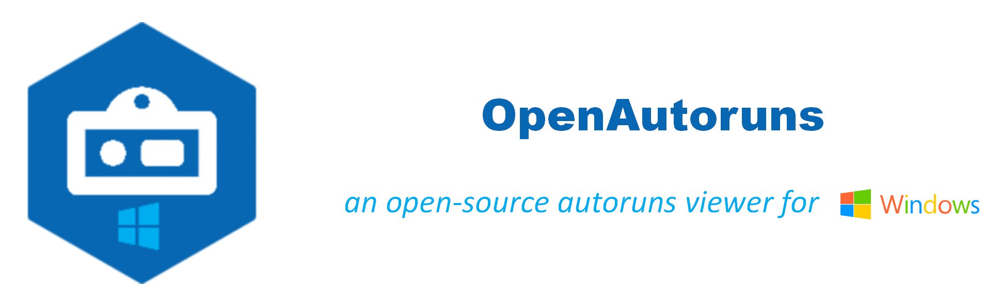

## OpenAutoruns on Windows 7 with Visual Studio 2017

<p align="center"></p>

### Overview

**OpenAutoruns** is an open-source autoruns viewer for Windows built upon [Microsoft WPF Framework](https://docs.microsoft.com/en-us/dotnet/desktop/wpf/). The window style is powered by [MahApps.Metro](https://github.com/MahApps/MahApps.Metro). The basic feature is referred to [Sysinternals Autoruns](https://docs.microsoft.com/en-us/sysinternals/downloads/autoruns). With this tool, you can easily view all kinds of autorun entries on your Windows system, including:

##### *Compulsory*

- [x] **Logon**: Startup Directories and Registries based Autoruns
- [x] **Services**: Services based Autoruns
- [x] **Drivers**: Drivers based Autoruns
- [x] **Scheduled Tasks**: Scheduled Tasks based Autoruns

##### *Optional*

- [x] **Internet Explorer**: Browser Helper Objects (BHOs) of Internet Explorer based Autoruns
- [ ] **Boot Execute**: Boot Execute based Autoruns
- [ ] **Image Hijacks**: Image Hijacks based Autoruns
- [x] **Known DLLs**: Known DLLs based Autoruns
- [ ] **Winsock Providers**: Winsock Service Provider based Autoruns
- [ ] **Winlogon**: Windows User Logon based Autoruns

### Usage

Just download this repo and open `OpenAutoruns.sln` with your Visual Studio 2017. 

Welcome to contribute!

##### *Note*

1. Run Visual Studio as Administrator.

2. About my Development Environment:

   * Windows 7
   * Visual Studio 2017
   * .NET Framework 4.7
   * .NET Core 3.1
   * Visual C# WPF App

   So if you have different version of Visual Studio, you may need to create a WPF App from scratch and add all source files.

3. Install `MahApps.Metro` with NuGet Package Manager Console:

   ```
   PM> Install-Package MahApps.Metro
   ```

4. Add the reference to `./OpenAutoruns/Utilities/Interop.TaskScheduler.dll` to use the namespace `TaskScheduler`.

5. Also, I've tested on Windows 10 with Visual Studio 2019, [Here](https://github.com/zhliuworks/OpenAutoruns) is the source code. There exists a little change due to C# compilation version, such as method `StartsWith` and `Contains`.

### License

GNU General Public License v3.0
